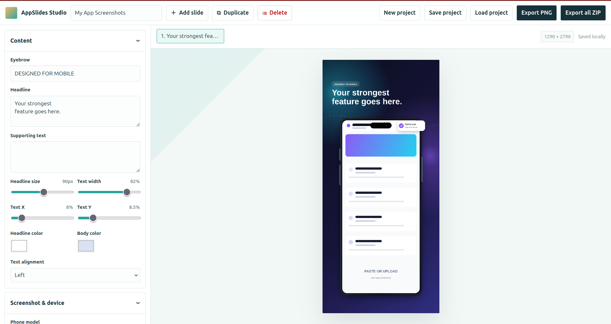

# AppSlides Studio

## What is this?
AppSlides Studio is an in-browser utility that helps you create catchy screenshots for your apps. It provides tools to add an informational and artistic touch to your mobile app store submission without using those expensive design tools.

Current project is stored in local storage to survive refreshes, and you can import/export JSON projects.

The whole thing runs in your browser, it is mostly vibe-coded and based on my Affinity templates for similar tasks.

Use it as is, hack it or let an agent go wild.



## Setup

```sh
npm install
npm run dev
```

Build locally:

```sh
npm run build
```

## Hosting

This project is prepared for GitHub Pages. Push it to a GitHub repository, then set `Settings -> Pages -> Build and deployment -> Source` to `GitHub Actions`.
